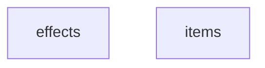
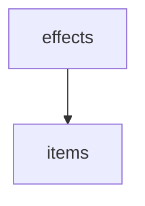
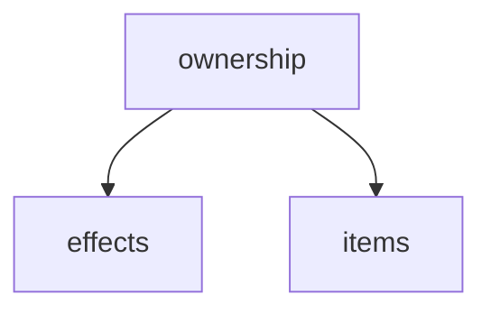
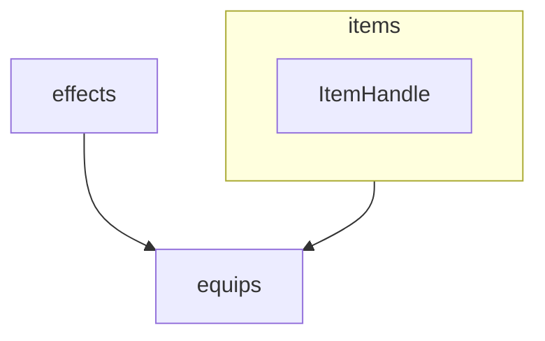

<br/>
<br/>
<br/>
<br/>
<br/>



<br/>
<br/>
<br/>
<br/>
<br/>




<br/>
<br/>
<br/>
<br/>
<br/>



```lua

local slot = 1

local handle = ent.inventory:generateHandle(slot)

handle:isValid()
handle:getItem()


ent.inventory:set()


```


