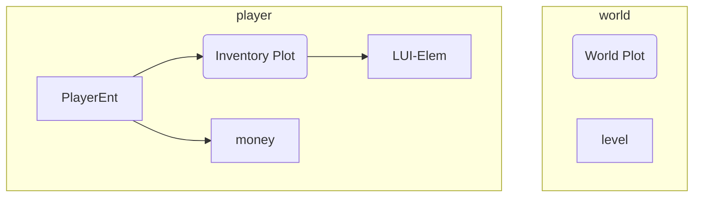
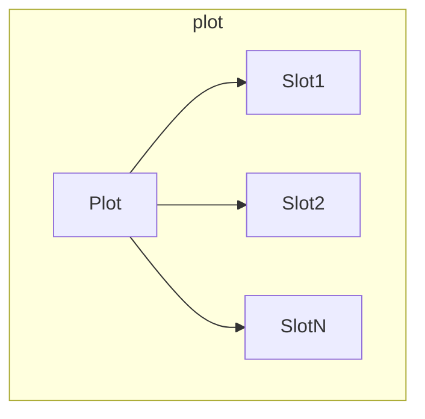
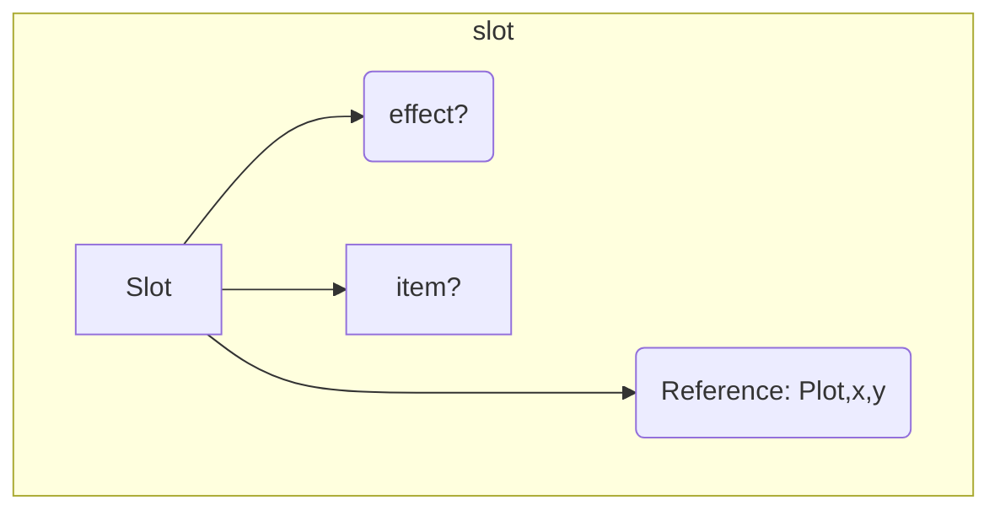
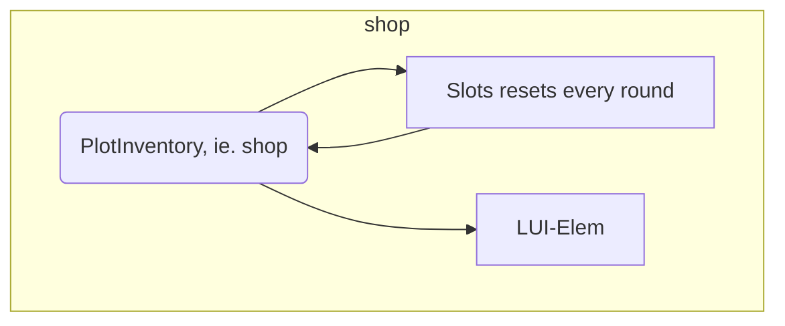

# ARCHITECTURE.md

 
 
 

# Plots:
A `Plot` is a 2d region where Slots/items are kept.

An inventory is also a `Plot`;   
The world also contains a bit `Plot`.

 
 
 

# Slots:
A `Slot` contains an Item. (That is it's only purpose.)   
Slots are contained inside of `Plot`s; 
and contain a back-reference to it's Plot.

Important things to note:
- `Slot`s CANNOT be moved out of a `Plot`.
    - They can only be deleted/augmented.

- How are items moved between Plots?
    - They aren't. Items are moved between `Slot`s.

 
 
 

# Shops and GUI:
Shops and GUI use `Plot`s too.   
This means that item-activations can occur within shop/inventory!!!   

## Loot boxes, rerolls, etc:
The above setup; (where everything is a Plot,)
also gives us a fantastic way to represent loot-boxes and stuff too.   
---> Player opens loot-box:   
- lootBoxEnt is created; contains a PlotInventory + reroll slots
- lootBoxEnt is pushed onto the stack; blocking all other input
- Items appear in lootBox's slots.
- (Player can choose to take the items, OR close the inventory)

