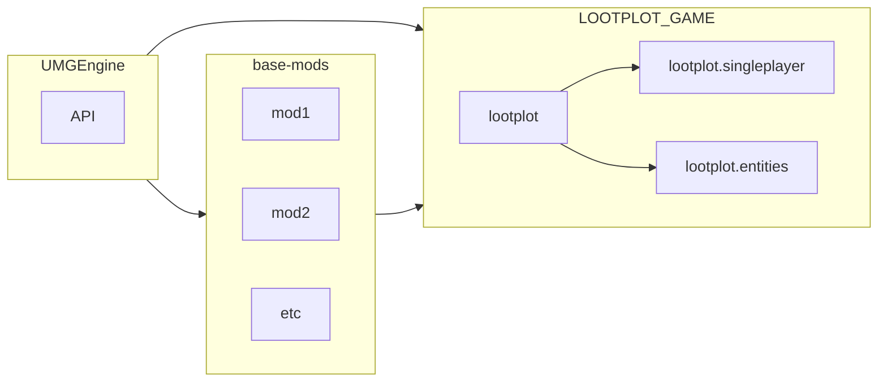
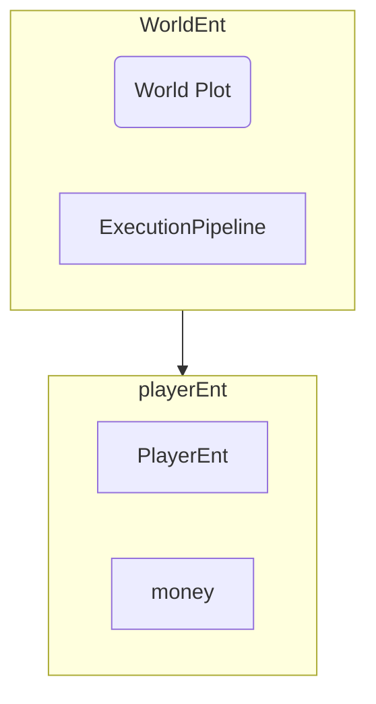
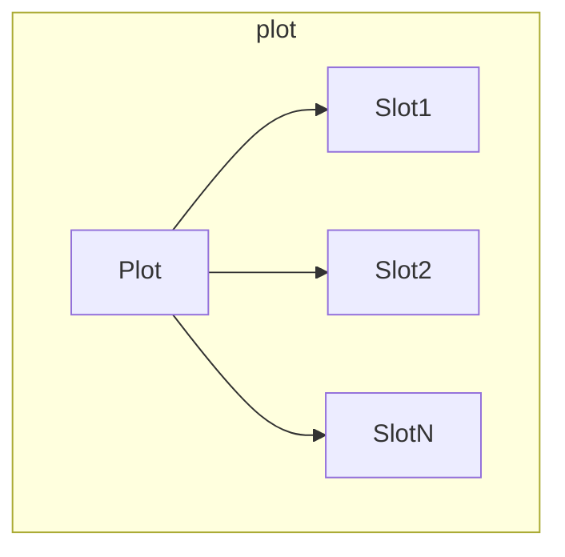
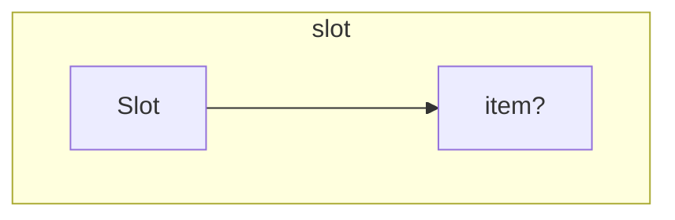

# ARCHITECTURE.md

In this example, `LOOTPLOT_GAME` is a mod *bundle.*

What's interesting, is that the `lootplot` mod makes NO ASSUMPTIONS about how the game works. 
It's `lootplot.singleplayer` that actually provides the base "assumptions",
like the loot-monster, and win-condition, etc.

## `lootplot`:
Provides basic API for everything.   
Emits events for points; but does not keep track of points.
Defines a bunch of basic augments/systems/components to be used elsewhere.

## `lootplot.singleplayer`:
Provides the loot-monster, alongside a win-condition.  
Spawns a shop.  
Spawns base-slots in.

## `lootplot.items`:
Provides a tonne of basic items for lootplot.

 
 
 
 

# Internal structure:

 
 
 

# Plots:
A `Plot` is a 2d region where Slots/items are kept.

An inventory is also a `Plot`;   
The world also contains a bit `Plot`.

 
 
 

# Slots:
A `Slot` contains an Item. (That is it's only purpose.)   
Slots are contained inside of `Plot`s; 
and contain a back-reference to it's Plot.

Important things to note:
- `Slot`s CANNOT be moved out of a `Plot`.
    - They can only be deleted/augmented.

- How are items moved between Plots?
    - They aren't. Items are moved between `Slot`s.

 
 

# PPos
A `PPos` is a "Plot position".  
It represents a position within a plot.   
These are EXTREMELY useful objects.

 
 

# Shops
Theres not really such thing as a "shop" in lootplot...   
----->   
Shops are represented by "buyable-slots" inside the world-plot.   
This means that entities/items can interact with, and expand the shop.

 
 

