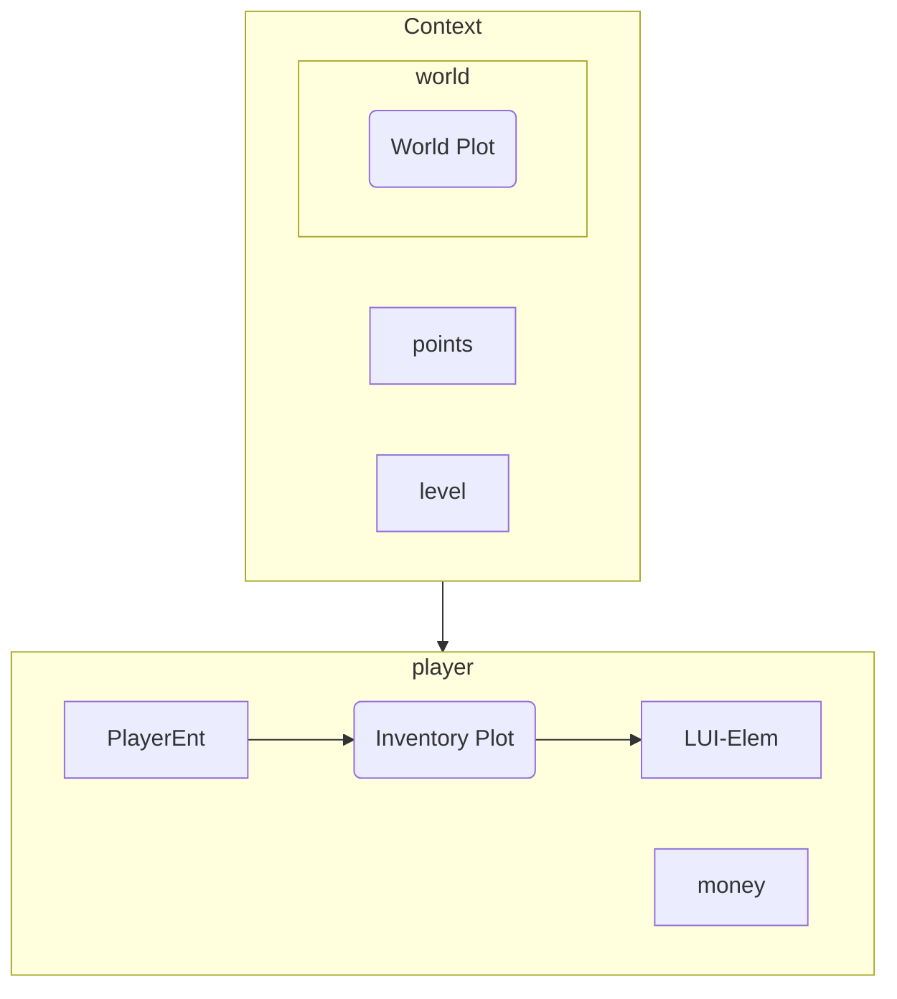
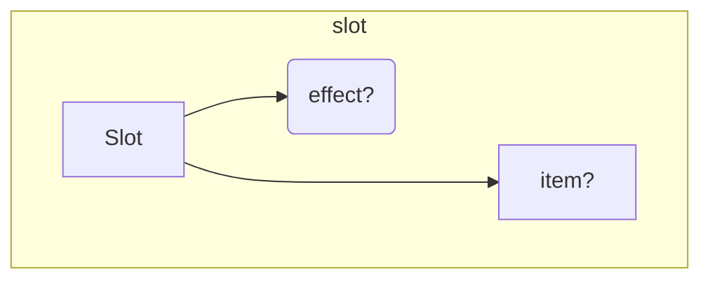

# ARCHITECTURE.md




<br/>
<br/>
<br/>

# Plots:
A `Plot` is a 2d region where Slots/items are kept.

An inventory is also a `Plot`;   
The world also contains a bit `Plot`.


<br/>
<br/>
<br/>

# Slots:
A `Slot` contains an Item. (That is it's only purpose.)   
Slots are contained inside of `Plot`s; 
and contain a back-reference to it's Plot.


Important things to note:
- `Slot`s CANNOT be moved out of a `Plot`.
    - They can only be deleted/augmented.

- How are items moved between Plots?
    - They aren't. Items are moved between `Slot`s.

<br/>
<br/>
<br/>

# Position-tracking:
Slots and Items need to be able to tell WHERE they are.<br/>
But... its hard to do this without strong-referencing.  
If we reference the `Plot` object in a component; that implies that the slot/item OWNS the plot!!!  
(which is bad)

To solve this, lootplot uses a module called `ptrack`, that keeps back-references to entities:
```lua
Ptrack {
    [ent] -> ppos
}
```
This exposes a robust internal API for tracking slot/item positions:
```lua
ptrack.set(ent, ppos)
ptrack.get(ent, ppos)
```


<br/>
<br/>
<br/>


# Shops
Shops are represented by "buyable-slots" inside the world-plot.

This means that entities/items can interact with, and expand the shop.

